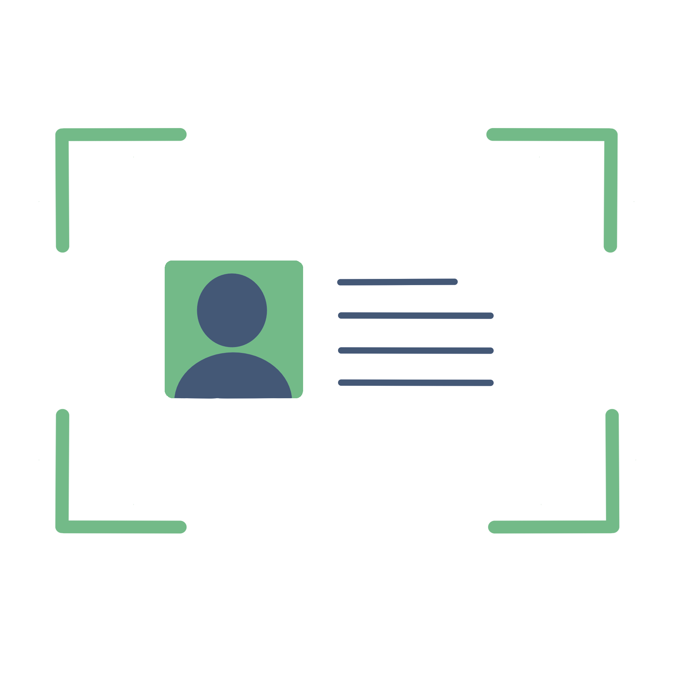
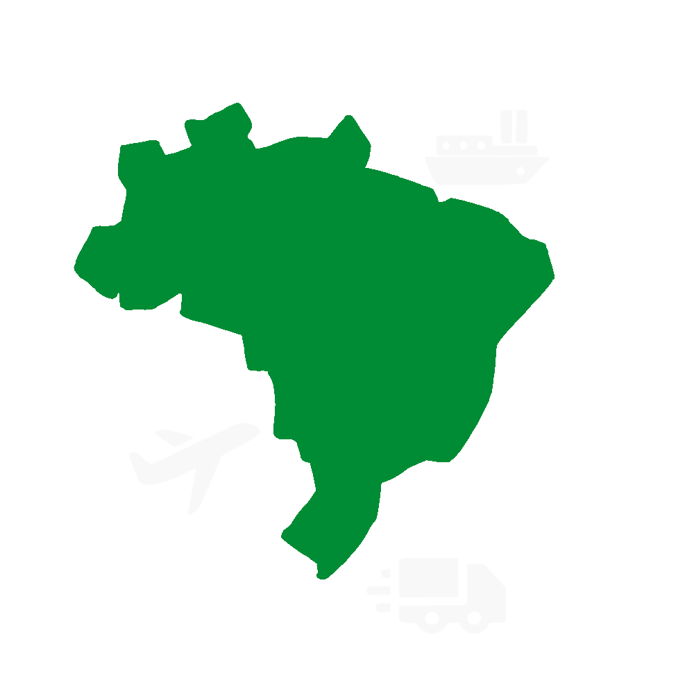

# Portfólio - Julia Soares Pereira

## 👤 Introdução

Me chamo Julia Soares Pereira, tenho 20 anos de idade e atualmente estou no caminho para concluir o curso de Análise e Desenvolvimento de Sistemas na Fatec Prof. Jessen Vidal. Finalizei o Ensino Fundamental e Médio na Escola Walter Fortunato, encerrando o Ensino Médio em 2023 e ingressando na graduação no primeiro semestre de 2024. Esta é minha primeira graduação após sair do colégio.

Apesar de meu primeiro contato técnico com programação ter acontecido por meio de um curso de Lógica de Programação oferecido pelo Senai “Santos Dumont” e concluído em julho de 2023, a ideia de seguir na área da tecnologia surgiu ainda durante o Ensino Médio. Na época, eu buscava uma segunda possibilidade de carreira além da dança, atividade que também faz parte da minha trajetória pessoal. Integro um grupo avançado de sapateado americano, participando de competições e apresentações em eventos, muitas vezes remuneradas. Sempre tive interesse em construir uma carreira mais independente dentro da dança, ministrando workshops e desenvolvendo meu próprio reconhecimento na área, mas também percebia a necessidade de possuir um plano profissional mais estável e seguro.

Foi nesse contexto que a programação começou a despertar meu interesse. A valorização da arte no Brasil, especialmente de expressões menos populares como o sapateado, ainda enfrenta muitos desafios, e encontrei na tecnologia uma área na qual também me sentia capaz de crescer e me desenvolver profissionalmente. O curso do Senai foi responsável por me introduzir aos primeiros conceitos fundamentais da programação, como estruturas de repetição e condição, além de expressões aritméticas, literais e lógicas, servindo como ponto de partida para minha formação.

A escolha pela Fatec e pelo curso de Análise e Desenvolvimento de Sistemas aconteceu após sugestões vindas de familiares e pesquisas sobre a instituição, sua reputação, a estrutura curricular do curso e o corpo docente. Além disso, ouvi comentários de que ADS era conhecido informalmente como um dos cursos mais acessíveis para quem estava começando na área de tecnologia, o que me chamou atenção por parecer uma introdução mais amigável para iniciantes. Após conhecer melhor a proposta do curso, percebi que ele atendia às minhas expectativas e representava exatamente o tipo de formação que eu buscava.

Hoje, a programação se tornou uma área pela qual tenho grande interesse, especialmente no desenvolvimento Front-end. Gosto da liberdade criativa que o desenvolvimento de interfaces proporciona e da possibilidade de transformar ideias em experiências visuais e funcionais. A sensação de construir algo do zero e perceber que praticamente não existem limites para o que pode ser criado é algo que constantemente me motiva. Ao mesmo tempo em que reconheço a evolução técnica que já tive durante a graduação, também entendo que ainda existe uma enorme variedade de tecnologias e conteúdos para aprender — e isso não me desanima, mas reforça ainda mais meu interesse pela área.

Até o momento, tive experiências profissionais voltadas ao desenvolvimento web e manutenção de sites. Minha primeira experiência formal aconteceu por meio de um estágio remoto na empresa Hospedagem Barra Grande, localizada no estado do Piauí, onde atuei como estagiária em desenvolvimento Front-end. Fui responsável por dar continuidade ao desenvolvimento do site da empresa utilizando WordPress e snippets de código escritos em HTML, CSS, JavaScript e PHP, além de prestar suporte técnico sempre que surgiam dúvidas relacionadas ao funcionamento da plataforma. Além disso, realizei, de forma independente, modificações e correções no site da marca de roupas Ana Fernandes. O projeto também envolveu a manutenção de um site em WordPress que apresentava diversos problemas técnicos, plugins desatualizados e inconsistências visuais. Após as melhorias realizadas, a plataforma passou a operar de forma estável, contribuindo para uma melhor experiência de uso e para o fortalecimento da presença digital da marca. Estou buscando por novas oportunidades atualmente.

Ao longo da graduação, venho buscando desenvolver não apenas conhecimentos técnicos, mas também habilidades práticas e comportamentais por meio de projetos acadêmicos. O objetivo deste repositório é documentar minha evolução e participação nos trabalhos semestrais realizados durante o curso, também conhecidos como APIs (Aprendizado por Projetos Integradores).

## 📞 Contatos

## 🌐 Principais Conhecimentos e Ferramentas

|  |  |  |  |  |  |  |  |  |
|-----------------|----------------|----------------|-----------------|-----------------|----------------|----------------|-----------------|----------------|
|  |  |  |  |  |  |  |  |  |
|  |  |  |  |  |  |  |  | 

## 📌 Projetos API

 

1° Semestre (2024-1) | Mestre Ágil

**Conclusão:** *Junho/2024*  
**Empresa:** FATEC São José dos Campos - Professor Antônio Egydio São Tiago Graça, cliente simulado. 

**Problema:**  
O cliente relatou que os funcionários de sua empresa possuíam pouco conhecimento sobre a metodologia ágil SCRUM, o que dificultava sua aplicação no ambiente corporativo. A falta de compreensão sobre os papéis, eventos, valores e práticas do framework comprometia a organização e a eficiência dos processos internos. Diante disso, surgiu a necessidade de uma solução que facilitasse o aprendizado e promovesse uma melhor assimilação dos conceitos do SCRUM de forma clara, acessível e prática.

**Objetivo:**  
Desenvolver uma plataforma web educacional dedicada à metodologia SCRUM, reunindo conteúdos teóricos, referências e exemplos práticos em um ambiente acessível e intuitivo. O sistema deveria apresentar os principais elementos do framework de forma organizada e didática, proporcionando uma experiência de aprendizado mais dinâmica e eficiente aos usuários. 

**Solução:**  
Foi desenvolvido o “Mestre Ágil”, uma plataforma web voltada ao ensino de SCRUM por meio de conteúdos teóricos, quizzes e uma avaliação final com emissão de certificado. O sistema também disponibiliza modelos de artefatos SCRUM e a ferramenta “PACER”, utilizada para auxiliar Scrum Masters na análise do desempenho de suas equipes. O backend foi desenvolvido em Python com Flask integrado a um banco SQLite, enquanto o frontend utilizou HTML, CSS, Bootstrap e JavaScript. A aplicação foi hospedada em uma instância AWS EC2 com NGINX como proxy reverso.

  

 
 

Para mais informações, o repositório do projeto está disponível [aqui](https://github.com/Titus-System/1Semestre-ADS).

### 💻 Tecnologias Utilizadas
| Nome       | Descrição                                              |
|------------|--------------------------------------------------------|
| HTML5      | Estruturação de páginas web                            |
| CSS3       | Estilização das páginas web                            |
| JavaScript | Adicionar dinamismo às páginas e aos questionários     |
| Bootstrap  | Framework CSS para tornar a estilização mais prática   |
| Python     | Linguagem usada no backend e em regras de negócio      |
| Flask      | Framework web usado para rotas, templates e autenticação |
| SQLite     | Banco de dados relacional para usuários, conteúdos teóricos e avaliações |
| AWS        | Serviço usado para hospedar o servidor                  |
| NGINX      | Proxy reverso e configuração de tráfego HTTPS          |
| Git / GitHub     | Colaboração simultânea e gestão do projeto            |
| Figma      | Desenvolvimento dos wireframes do MVP do projeto                 |
| Krita      | Desenhar o logo da aplicação                 |

### 🎯 Contribuições Pessoais
Atuei como integrante do time de desenvolvimento (Dev Team) durante o primeiro semestre, contribuindo principalmente nas áreas de conteúdo, experiência do usuário e interface da plataforma.

- Elaboração do logotipo da aplicação pelo Krita.
- Escrita da apostila digital contendo o conteúdo teórico utilizado na plataforma.
- Escrita do guia prático responsável por orientar os usuários sobre a utilização dos recursos do sistema.
- Escrita de mensagens explicativas exibidas quando o usuário responde incorretamente às questões.
- Implementação da lógica Python dos tipos diferenciados de perguntas presentes nos quizzes, incluindo questões de associação e verdadeiro ou falso, com o objetivo de tornar as atividades mais dinâmicas e interativas.
- Estilização visual das páginas dos sistemas de quizzes e avaliação final com CSS3, incluindo os diferentes formatos de questões utilizados pela plataforma.
- Produção dos textos de apoio disponibilizados para consulta antes da realização dos quizzes.
- Criação das páginas de conteúdo exibidas entre as etapas dos quizzes com HTML5.
- Participação nas cerimônias do SCRUM e nas discussões relacionadas ao desenvolvimento e organização do projeto.

### ⚙️ Hard Skills
| Skill               |  Proficiência                   | 
|---------------------|---------------------------------|
| HTML5               | Consigo ensinar - 9/10          | 
| CSS3                | Consigo ensinar - 9/10          | 
| JavaScript          | Uso com autonomia - 7/10        |
| Bootstrap           | Uso com autonomia - 7/10        |
| Python              | Uso com autonomia - 7/10        |
| Flask               | Uso com autonomia - 6/10        |
| SQLite              | Uso com autonomia - 6/10        |
| AWS                 | Uso com autonomia - 6/10        |
| NGINX               | Ouvi falar - 2/10               |
| Git / GitHub        | Uso com autonomia - 8/10        |
| Figma               | Uso com autonomia - 8/10        |
| Krita               | Uso com autonomia - 7/10        |

### 🧠 Soft Skills
- **🌱 Resiliência**: O primeiro semestre representou minha primeira experiência com trabalho em grupo fora do contexto escolar tradicional, trazendo diversos desafios pessoais e interpessoais. Antes mesmo do kick-off do projeto, precisei lidar com a dificuldade de conhecer pessoas novas e formar uma equipe para ter com quem atuar ao longo do semestre. Como costumo ser mais reservada em ambientes desconhecidos, tive que sair da minha zona de conforto para iniciar conversas e construir conexões com meus colegas. Essa experiência me ajudou a desenvolver maior confiança em situações novas e a compreender a importância da adaptação e da iniciativa em ambientes colaborativos.

- **🤔 Pensamento Crítico**: Durante o primeiro semestre, participei de uma situação delicada envolvendo a possível realocação de um integrante da equipe. Foi uma experiência inesperada para o primeiro projeto acadêmico, e exigiu uma análise madura sobre comprometimento, entregas e impacto no desempenho do grupo. Ao longo das discussões, percebemos que existia uma diferença significativa entre o nível de conhecimento que o integrante demonstrava verbalmente e os resultados efetivamente entregues, o que acabava sobrecarregando outros membros da equipe. Essa experiência contribuiu para o desenvolvimento da minha capacidade de avaliar situações de forma mais crítica, equilibrada e profissional dentro de contextos que exigem cooperação e responsabilidade coletiva.

- **🫂 Empatia**: Durante o primeiro semestre, nosso grupo contou com a participação de um integrante mais velho, que demonstrava maiores dificuldades de adaptação às tecnologias e ferramentas utilizadas no curso. Apesar de a maioria da equipe também estar tendo seus primeiros contatos acadêmicos com programação, existia uma familiaridade natural com o ambiente digital devido à nossa geração. O processo realmente poderia ser mais desafiador para quem viesse de gerações anteriores. Buscamos auxiliá-lo da melhor forma possível, tentando explicar conceitos e tarefas de maneira mais acessível, mas também precisávamos equilibrar esse suporte com os prazos e demandas do projeto. Diante disso, adaptamos a divisão de tarefas para que ele pudesse contribuir dentro de suas possibilidades, participando de atividades mais conceituais e organizacionais. Essa experiência fortaleceu minha empatia e minha capacidade de lidar com diferentes ritmos de aprendizado em situações que exigiam paciência, adaptação e cooperação entre os integrantes da equipe.

 

2° Semestre (2024-2) | IDScan

**Conclusão:** *Dezembro/2024*  
**Empresa:** FATEC São José dos Campos - Professor Giuliano Araújo Bertoti, cliente simulado. 

**Problema:**  
Empresas e instituições lidam diariamente com grandes volumes de documentos, como currículos, contas, notas fiscais, formulários e relatórios. Quando a extração de informações desses arquivos depende exclusivamente da atividade humana, o processo se torna lento, repetitivo e suscetível a falhas, comprometendo a produtividade e a confiabilidade dos dados obtidos. 

**Objetivo:**  
Desenvolver um software capaz de automatizar a extração de informações de documentos utilizando modelos de linguagem e visão computacional. O projeto deve ser voltado ao processamento de um tipo específico de documento, ficando a critério de cada grupo definir qual tipo seria abordado em sua solução.

**Solução:**  
Foi desenvolvida a solução local “IDScan”, aplicação desktop capaz de digitalizar documentos RG e armazenar dados extraídos em um banco MySQL local. O sistema utiliza OCR com Tesseract e modelos executados via Ollama para identificar informações como CPF, data de nascimento, naturalidade e filiação a partir das imagens do documento. O usuário realiza o upload das imagens da frente e do verso do RG, podendo corrigir manualmente informações extraídas de forma incorreta ou incompleta. Após validação, os dados podem ser salvos e consultados futuramente.

  

 
 

Para mais informações, o repositório do projeto está disponível [aqui](https://github.com/Titus-System/2semestre-ADS).

### 💻 Tecnologias Utilizadas
| Nome       | Descrição                                              |
|------------|--------------------------------------------------------|
| Java       | Linguagem de programação principal                     |
| Maven      | Gerenciamento de dependências e build                  |
| Tesseract OCR | Reconhecimento óptico de caracteres das imagens     |
| Ollama     | Execução local de modelos para interpretação dos campos extraídos |
| MySQL      | Banco de dados relacional local para persistência dos documentos  |
| JavaFX     | Construção visual das telas da aplicação               |
| Scene Builder | Estruturação visual e prototipagem das interfaces em JavaFX |
| Git / GitHub     | Colaboração simultânea                           |
| Jira     | Gestão de tarefas e burndown                                  |
| Figma      | Desenvolvimento dos wireframes do MVP do projeto                 |
| Krita      | Desenhar o logo da aplicação                 |

### 🎯 Contribuições Pessoais
Atuei novamente como integrante do time de desenvolvimento (Dev Team) durante o segundo API, sendo responsável principalmente pelas funcionalidades relacionadas à interface gráfica da aplicação em JavaFX.

- Desenvolvimento das interfaces da aplicação utilizando JavaFX.
- Elaboração do logotipo da aplicação pelo Krita.
- Implementação da estilização visual de todas as telas do sistema com JavaFX, incluindo as telas de upload de documentos, pré-visualização das imagens inseridas, carregamento e exibição dos resultados extraídos.
- Implementação da responsividade da interface com JavaFX, permitindo o uso da aplicação tanto em tela cheia quanto em formatos reduzidos.
- Uso de Java para desenvolvimento da funcionalidade de arrastar e soltar arquivos (“drag and drop”) na área de upload, além do envio tradicional por seleção de arquivos, e da funcionalidade de pesquisa por dados específicos na tela de resultados.
- Implementação de feedbacks visuais com JavaFX para indicar sucesso ou falha durante as operações realizadas pelo usuário.
- Uso de Java para permitir apenas o envio de arquivos de imagens para a aplicação.
- Participação nas cerimônias do SCRUM e nas discussões relacionadas ao desenvolvimento e organização do projeto.

### ⚙️ Hard Skills
| Skill                   |  Proficiência             |
|-------------------------|---------------------------|
| Java                    | Uso com autonomia - 6/10  |
| Maven                   | Ouvi falar - 2/10         |
| Tesseract OCR           | Ouvi falar - 3/10         |
| Ollama                  | Uso com ajuda - 5/10      |
| MySQL                   | Uso com autonomia - 7/10  |
| JavaFX                  | Uso com autonomia - 7/10  |
| Scene Builder           | Uso com autonomia - 7/10  |
| Git / GitHub            | Uso com autonomia - 7/10  |
| Jira                    | Uso com autonomia - 6/10  |
| Figma                   | Uso com autonomia - 8/10  |
| Krita                   | Uso com autonomia - 7/10  |

### 🧠 Soft Skills
- **🚀 Proatividade**: Durante o segundo semestre, nossa turma foi introduzida ao Java, mas, em meio ao API, nos deparamos com um uso específico da linguagem ao qual não havíamos sido introduzidos ainda, e nenhum integrante possuia conhecimento prévio sobre ele: desenvolvimento de interfaces gráficas. Como eu já demonstrava maior interesse por frontend e design de interfaces, fiquei responsável por aprender e conduzir as tarefas relacionadas ao JavaFX. Para isso, busquei conteúdos de forma autônoma, assistindo a vídeos e estudando o uso da ferramenta Scene Builder para compreender a estruturação das telas da aplicação. Além de representar um grande desafio técnico, essa experiência reforçou minha iniciativa em aprender novas tecnologias e assumir responsabilidades importantes para o desenvolvimento do projeto.

- **👍 Atitude Positiva**: Durante o segundo semestre, nossa equipe precisou utilizar o Jira como ferramenta de gerenciamento de tarefas em substituição ao GitHub Projects, e acabei reconhecendo que tinha uma forte preferência pela ferramenta substituída. Apesar da dificuldade para compreender completamente o funcionamento e o fluxo de uso do Jira, procurei encarar essa mudança de forma positiva, entendendo-a como uma oportunidade de adaptação e aprendizado dentro de um ambiente colaborativo.

- **🤝 Trabalho em Equipe**: Durante o desenvolvimento do “IDScan”, fui a principal responsável por transformar o protótipo visual em telas funcionais integradas aos dados reais do sistema. Como o projeto envolvia diferentes frentes de desenvolvimento, como OCR, modelos de linguagem e banco de dados, foi necessário manter alinhamento constante com os demais integrantes da equipe para compreender como as informações seriam processadas e exibidas na aplicação. Essa experiência reforçou minha capacidade de colaboração em projetos com responsabilidades técnicas divididas entre diferentes áreas.
 

 

3° Semestre (2025-1) | InsightFlow

**Conclusão:** *Junho/2025*  
**Empresa:** FATEC São José dos Campos - Marcus Vinícius do Nascimento, cliente simulado. 

**Problema:**  
Profissionais como economistas e gestores públicos enfrentam certas dores quando seu objetivo é acompanhar o desempenho dos estados brasileiros quanto ao comércio exterior. Alguns exemplos são longos períodos de pesquisa por informações específicas, grandes volumes de dados irrelevantes, desatualizados e/ou desorganizados e dificuldades na interpretação dos dados para tomar decisões. 

**Objetivo:**  
Desenvolver uma plataforma web sobre comércio exterior que solucione todas essas dores. 

**Solução:**  
Foi criado o “InsightFlow”, plataforma web voltada à análise do comércio exterior brasileiro entre 2014 e 2024. O site disponibiliza rankings, consultas e análises estatísticas por estados, países e setores, além de mapa de calor da balança comercial e gráficos com regressão linear, volatilidade e crescimento mensal. O backend está em Python com Flask, utilizando PostgreSQL e Redis, enquanto o frontend utiliza React, TypeScript, Vite e TailwindCSS. A aplicação possui arquitetura dockerizada e integração com modelo SARIMA para previsão de tendências.

  

 
 

Para mais informações, o repositório principal do projeto está disponível [aqui](https://github.com/Titus-System/InsightFlow).

### 💻 Tecnologias Utilizadas
| Nome             | Descrição                                              |
|------------------|--------------------------------------------------------|
| Python           | Linguagem do backend, pipeline de dados e análises estatísticas      |
| Jupyter Notebook | Prototipação e iteração do pipeline de limpeza e tratamento dos dados do ComexStat         |
| Pandas           | Tratamento, limpeza e agregação dos datasets brutos do governo     |
| NumPy            | Operações numéricas vetorizadas usadas pelas análises estatísticas              |
| Scikit-learn     | Apoio à modelagem das análises estatísticas (regressão linear)           |
| StatsModels      | Implementação do modelo SARIMA e demais análises temporais     |
| Flask            | REST API que serve dados e análises ao frontend         |
| PostgreSQL       | Banco relacional com aproximadamente 30M de registros, índices e materialized views para agregações pesadas     |
| Redis            | Cache para resultados de operações de rankeamento que excedem o limite de 1 segundo de tempo de resposta    |
| Docker           | Containerização da aplicação para deploy reproduzível   |
| AWS              | Serviço usado para hospedagem da aplicação              |
| HTML5            | Estruturação das páginas web                            |
| TypeScript       | Tipagem estática no frontend                            |
| React            | Biblioteca para estruturar a interface da aplicação com componentes reutilizáveis    |
| Vite             | Build e dev server do frontend                          |
| TailwindCSS      | Framework para estilização utilitária e responsiva      |
| Git/GitHub       | Colaboração simultânea                                  |
| Figma            | Desenvolvimento dos wireframes do MVP do projeto        |
| Krita            | Desenhar o logo da aplicação                            |
| Jira             | Gestão de tarefas e burndown                            |

### 🎯 Contribuições Pessoais
Atuei como integrante do time de desenvolvimento (Dev Team) durante o terceiro semestre, contribuindo principalmente nas áreas de interface, visualização de dados e padronização visual da plataforma.

- Elaboração do logotipo da aplicação pelo Krita.
- Criação do protótipo visual no Figma, utilizado como base para a identidade visual e estrutura das páginas do sistema.
- Desenvolvimento do VPC (Value Proposition Canvas) da solução, documentando visualmente o perfil do cliente, suas dores, ganhos e a proposta de valor da aplicação.
- Implementação de componentes reutilizáveis da interface de acordo com o padrão do React, incluindo navbar e rodapé responsivos e compatíveis com diferentes dispositivos.
- Contribuição na padronização visual e estilização geral das páginas da plataforma com TailwindCSS.
- Implementação de ajustes de responsividade com TailwindCSS para garantir a correta visualização do sistema em diferentes tamanhos de tela.
- Escrita dos códigos responsáveis pela estruturação dos setores econômicos exibidos nos gráficos da aplicação por meio de arquivos JSON.
- Participação nas cerimônias do SCRUM e nas discussões relacionadas ao desenvolvimento e organização do projeto.

Minhas principais contribuições estiveram concentradas na página de Análise de Estados:

- Desenvolvimento e integração ao backend do mapa de calor do Brasil, no qual as cores dos estados variavam de acordo com a balança comercial calculada a partir da relação entre exportações e importações. O visual do mapa foi criado por meio da biblioteca Leaflet do React.
- Implementação da linha do tempo interativa utilizada para filtrar os dados exibidos entre os anos de 2014 e 2024.
- Desenvolvimento visual e integração de um modal de informações exibido ao selecionar um estado no mapa, contendo dados como capital, área territorial, PIB e valores movimentados em importações e exportações.
- Criação (com a biblioteca Recharts do React) e integração dos gráficos de Exportações vs Importações, tanto na visão geral do estado quanto segmentados por setores econômicos, incluindo agronegócio, bens de consumo, indústria, mineração, setor industrial e tecnologia.

### ⚙️ Hard Skills
| Skill                   |  Proficiência             |
|-------------------------|---------------------------|
| Python                  | Uso com autonomia - 7/10  |
| Jupyter Notebook        | Ouvi falar - 2/10         |
| Pandas                  | Ouvi falar - 3/10         |
| NumPy                   | Ouvi falar - 2/10         |
| Scikit-learn            | Ouvi falar - 3/10         |
| StatsModels             | Ouvi falar - 3/10         |
| Flask                   | Uso com autonomia - 6/10  |
| PostgreSQL              | Uso com autonomia - 6/10  |
| Redis                   | Ouvi falar - 3/10         |
| Docker                  | Uso com ajuda - 5/10      |
| AWS                     | Uso com autonomia - 6/10  |
| HTML5                   | Consigo ensinar - 9/10    | 
| TypeScript              | Uso com autonomia - 6/10  |
| React                   | Uso com autonomia - 7/10  |
| Vite                    | Uso com autonomia - 6/10  |
| TailwindCSS             | Uso com autonomia - 8/10  |
| Git/GitHub              | Uso com autonomia - 7/10  |
| Figma                   | Uso com autonomia - 8/10  |
| Krita                   | Uso com autonomia - 7/10  |
| Jira                    | Uso com autonomia - 6/10  |

### 🧠 Soft Skills
- **🤹 Flexibilidade**: Em meio ao terceiro API, nossa equipe passou por uma redução significativa de integrantes ao longo do semestre, incluindo a saída da Scrum Master original do grupo. Com isso, os membros que permaneceram precisaram assumir novas responsabilidades e redistribuir as tarefas de forma estratégica para manter o andamento do projeto. Essa situação exigiu adaptação constante diante das mudanças na dinâmica da equipe, além de maior organização e colaboração entre os integrantes restantes. A experiência fortaleceu minha capacidade de lidar com mudanças inesperadas e me adaptar a cenários desafiadores dentro de um ambiente de trabalho em equipe.

- **🚀 Proatividade**: Como o produto desse terceiro semestre estava relacionado à área de comércio exterior, precisei buscar noções básicas sobre conceitos que até então eram desconhecidos para mim, como FOB, índice HHI, NCM e valor agregado. Apesar de não ser necessário um entendimento aprofundado sobre a área, percebi a importância de compreender minimamente esses termos para conseguir interpretar corretamente as necessidades do projeto e contribuir de forma mais eficiente para o desenvolvimento da solução.

- **💡 Criatividade**: Nossa equipe precisou definir cuidadosamente quais informações seriam mais relevantes para apresentar aos usuários e de que maneira elas seriam exibidas na plataforma. Durante as discussões iniciais, exercitamos bastante a criatividade na escolha das funcionalidades do sistema e na definição dos gráficos e indicadores que fariam parte da aplicação, já que o tema "comércio exterior" permite diferentes abordagens e interpretações. Além disso, também fui responsável pela criação do protótipo visual no Figma, o que exigiu ainda mais criatividade na construção de uma interface organizada, intuitiva e visualmente agradável para os usuários.

 

4° Semestre (2025-2) | NEXA

**Conclusão:** *Dezembro/2025*  
**Empresa:** TecSys Brasil, empresa de comércio exterior e soluções fiscais - Creonice Honório.

**Problema:**  
A empresa cliente importava muitos produtos do exterior, principalmente componentes eletrônicos, o que exigia a criação de declarações detalhadas para a Receita Federal. Esse processo era realizado manualmente pelos analistas fiscais, que precisavam consultar diferentes fontes para relacionar informações como part-number, fabricante, país de origem e classificação fiscal (NCM) de cada item importado. Além disso tornar o processo lento e cansativo, a dependência exclusiva da atividade humana aumentava significativamente o risco de inconsistências, erros nas descrições e possíveis multas ou atrasos nos processos aduaneiros.

**Objetivo:**  
Desenvolver uma solução capaz de automatizar a criação de declarações aduaneiras para a Receita Federal, reduzindo o tempo gasto pelos analistas e minimizando riscos de inconsistências no processo. A aplicação deve gerar descrições completas dos produtos importados a partir de suas informações, garantindo maior clareza na identificação dos itens declarados. Dessa forma, garante-se um processo mais eficiente, padronizado e menos suscetível a questionamentos, penalidades ou multas.

**Solução:**  
Foi desenvolvido o “Nexa”, site voltado à criação automática de descrições aduaneiras para produtos importados. Ele recebe part-numbers individuais ou extraídos de PDFs e gera informações como descrição técnica, classificação fiscal e alíquota do produto. O backend foi desenvolvido em Python com Flask utilizando PostgreSQL, Redis e Celery, enquanto o frontend utiliza React, TypeScript, Vite e TailwindCSS. A solução web também integrou agentes baseados em smol-agents, Ollama e ChromaDB para pesquisa e organização das informações coletadas.

  

 
 

Para mais informações, o repositório principal do projeto está disponível [aqui](https://github.com/Titus-System/Nexa).

### 💻 Tecnologias Utilizadas
| Nome                       | Descrição                                                           |
|----------------------------|---------------------------------------------------------------------|
| Python                     | Linguagem do backend e do serviço de IA                             |
| Pytest                     | Testes automatizados do backend                                     |
| Pydantic                   | Validação e tipagem dos dados de entrada/saída                      |
| Flask/Flask-RESTful        | API REST do orquestrador (Nexa-api)                                 |
| Flask-SocketIO             | Comunicação WebSocket em tempo real com o frontend                  |
| Socket.IO-client           | Recepção de eventos de progresso em tempo real                      |
| Celery                     | Fila de tarefas assíncronas para processamento pesado               |
| PostgreSQL                 | Banco relacional para usuários, operações e resultados              |
| Redis                      | Broker do Celery, cache e Pub/Sub entre Nexa-api e Nexa-AI-Agents   |
| SQLAlchemy                 | ORM para persistência no PostgreSQL                                 |
| Ollama                     | Execução local do modelo qwen2.5:14b                                |
| smol-agents                | Framework para criação dos agentes de IA                            |
| ChromaDB                   | Banco vetorial para RAG (Retrieval-Augmented Generation)            |
| PDFPlumber                 | Extração de part-numbers de PDFs de pedido de compra                |
| HTML5                      | Estruturação das páginas web                                        |
| React                      | Biblioteca para estruturar a interface da aplicação com componentes reutilizáveis  |
| TypeScript                 | Tipagem estática no frontend                                        |
| Vite                       | Build e dev server do frontend                                      |
| TailwindCSS                | Framework para estilização utilitária e responsiva                  |
| Docker / Docker Compose    | Containerização e orquestração local dos serviços                   |
| Gunicorn                   | 	Servidor de produção do backend                                    |
| Git/GitHub                 | Colaboração simultânea                                              |
| Figma                      | Desenvolvimento dos wireframes do MVP do projeto                    |
| Jira                       | Gestão de tarefas e burndown                                        |

### 🎯 Contribuições Pessoais
Atuei como Scrum Master pela primeira vez durante o quarto semestre, sendo responsável tanto pelo acompanhamento das atividades da equipe quanto pelo desenvolvimento de funcionalidades relacionadas ao frontend da aplicação.

- Criação do protótipo visual no Figma, utilizado como base para a identidade visual e estrutura das páginas do sistema.
- Desenvolvimento da estrutura visual das telas da aplicação utilizando HTML5, TypeScript e TailwindCSS.
- Implementação da responsividade da interface para diferentes tamanhos de tela e dispositivos.
- Desenvolvimento dos modos claro e escuro da aplicação por meio de TailwindCSS.
- Implementação da funcionalidade de upload de arquivos PDF, incluindo suporte a “drag and drop”, tudo por TypeScript.
- Contribuição na implementação da funcionalidade de exportação de dados para arquivos Excel.
- Contribuição na exibição de notificações de processamento em tempo real em qualquer página do sistema.
- Uso de TypeScript para implementação de funcionalidades de pesquisa, filtragem e ordenação na página de histórico de processamentos, incluindo buscas por NCM, fabricante e país de origem.
- Integração entre frontend e backend das funcionalidades de autenticação, incluindo login, logout e cadastro de usuários.
- Organização e acompanhamento das sprints por meio da elaboração e gerenciamento do PACER.
- Participação ativa nas cerimônias do SCRUM e no acompanhamento geral do fluxo de desenvolvimento da equipe.

### ⚙️ Hard Skills
| Skill                      |  Proficiência             |
|----------------------------|---------------------------|
| Python                     | Uso com autonomia - 7/10  |
| Pytest                     | Ouvi falar - 3/10         |
| Pydantic                   | Ouvi falar - 3/10         |
| Flask/Flask-RESTful        | Uso com ajuda - 4/10      |
| Flask-SocketIO             | Uso com ajuda - 4/10      |
| Socket.IO-client           | Ouvi falar - 3/10         |
| Celery                     | Ouvi falar - 2/10         |
| PostgreSQL                 | Uso com autonomia - 6/10  |
| Redis                      | Uso com ajuda - 4/10      |
| SQLAlchemy                 | Ouvi falar - 3/10         |
| Ollama                     | Uso com ajuda - 5/10      |
| smol-agents                | Uso com autonomia - 6/10  |
| ChromaDB                   | Ouvi falar - 2/10         |
| PDFPlumber                 | Ouvi falar - 3/10         |
| HTML5                      | Consigo ensinar - 9/10    | 
| React                      | Uso com autonomia - 7/10  |
| TypeScript                 | Uso com autonomia - 6/10  |
| Vite                       | Uso com autonomia - 6/10  |
| TailwindCSS                | Uso com autonomia - 8/10  |
| Docker / Docker Compose    | Uso com ajuda - 5/10      |
| Gunicorn                   | Ouvi falar - 2/10         |
| Git/GitHub                 | Uso com autonomia - 7/10  |
| Figma                      | Uso com autonomia - 8/10  |
| Jira                       | Uso com autonomia - 6/10  |

### 🧠 Soft Skills
- **👑 Liderança**: Durante o quarto semestre, nossa equipe enfrentou a saída da integrante que atuava como Product Owner e que também era uma das únicas pessoas responsáveis pelo frontend da aplicação. Com isso, o grupo passou a contar com apenas quatro integrantes, ficando sob minha responsabilidade praticamente todas as questões relacionadas a estruturação e desenvolvimento das interfaces do sistema. Essa situação exigiu maior autonomia e senso de responsabilidade da minha parte, já que o andamento do frontend passou a depender principalmente do meu trabalho e da minha capacidade de organizar e conduzir essa área do projeto.

- **🏷️ Organização**: O quarto semestre marcou minha primeira experiência atuando como Scrum Master, o que me trouxe novas responsabilidades relacionadas à organização e ao acompanhamento das sprints. Nesse período, o formato do PACER passou por mudanças, incluindo uma nova escala de pontuação e um novo modelo de avaliação entre os próprios integrantes da equipe. Durante a primeira aplicação desse novo formato, percebi apenas no momento da entrega das notas que a nova pontuação variava de 1 a 4, e não mais de 1 a 3 como nos semestres anteriores. Precisei adaptar rapidamente as notas naquele momento de passá-las para o professor responsável, deixando-as mais condizentes com o novo modelo de pontuação. Apesar disso, consegui lidar com a situação de forma tranquila e, posteriormente, alinhei corretamente as novas regras com a equipe para evitar que o problema se repetisse nas demais sprints.

- **⚖️ Ética no Trabalho**: Por se tratar do primeiro projeto desenvolvido para uma empresa externa e envolvendo documentos relacionados à Receita Federal, o quarto semestre exigiu bastante responsabilidade da equipe em relação à precisão das informações processadas pela aplicação. Buscamos manter cuidado constante na implementação das funcionalidades e na validação dos resultados apresentados ao cliente. Essa experiência reforçou minha percepção sobre a importância da responsabilidade e do comprometimento profissional no desenvolvimento de soluções voltadas a contextos reais.

