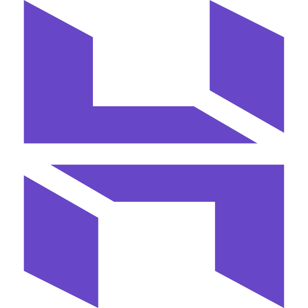
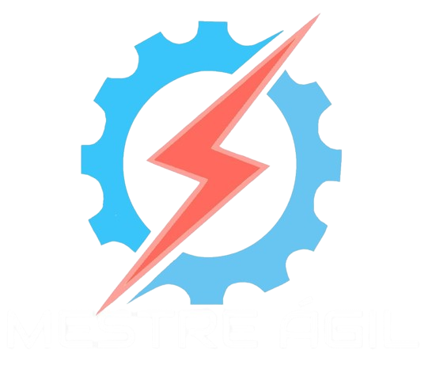

# Portfólio - Julia Soares Pereira

## 👤 Introdução

Me chamo Julia Soares Pereira, tenho 20 anos de idade e atualmente estou no caminho para concluir o curso de Análise e Desenvolvimento de Sistemas na Fatec Prof. Jessen Vidal. Finalizei o Ensino Fundamental e Médio na Escola Walter Fortunato, finalizando o Ensino Médio em 2023 e ingressando na graduação no primeiro semestre de 2024. Esta é minha primeira graduação após sair do colégio.

Apesar de meu primeiro contato técnico com programação ter acontecido por meio de um curso de Lógica de Programação oferecido pelo Senai “Santos Dumont”, concluído em julho de 2023, a ideia de seguir na área da tecnologia surgiu ainda durante o Ensino Médio. Na época, eu buscava uma segunda possibilidade de carreira além da dança, atividade que também faz parte da minha trajetória pessoal. Atualmente, integro um grupo avançado de sapateado americano, participando de competições e apresentações em eventos, muitas vezes remuneradas. Sempre tive interesse em construir uma carreira mais independente dentro da dança, ministrando workshops e desenvolvendo meu próprio reconhecimento na área, mas também percebia a necessidade de possuir um plano profissional mais estável e seguro.

Foi nesse contexto que a programação começou a despertar meu interesse. A valorização da arte no Brasil, especialmente de expressões menos populares como o sapateado, ainda enfrenta muitos desafios, e encontrei na tecnologia uma área na qual também me sentia capaz de crescer e me desenvolver profissionalmente. O curso do Senai foi responsável por me introduzir aos primeiros conceitos fundamentais da programação, como estruturas de repetição e condição, além de expressões aritméticas, literais e lógicas, servindo como ponto de partida para minha formação.

A escolha pela Fatec e pelo curso de Análise e Desenvolvimento de Sistemas aconteceu após pesquisas sobre a instituição, sua reputação, a estrutura curricular do curso e o corpo docente. Além disso, ouvi comentários de que ADS era conhecido informalmente como um dos cursos mais acessíveis para quem estava começando na área de tecnologia, o que me chamou atenção por parecer uma introdução mais amigável para iniciantes. Após conhecer melhor a proposta do curso, percebi que ele atendia às minhas expectativas e representava exatamente o tipo de formação que eu buscava.

Hoje, a programação se tornou uma área pela qual tenho grande interesse, especialmente no desenvolvimento Front-end. Gosto da liberdade criativa que o desenvolvimento de interfaces proporciona e da possibilidade de transformar ideias em experiências visuais e funcionais. A sensação de construir algo do zero e perceber que praticamente não existem limites para o que pode ser criado é algo que constantemente me motiva. Ao mesmo tempo em que reconheço a evolução técnica que já tive durante a graduação, também entendo que ainda existe uma enorme variedade de tecnologias e conteúdos para aprender — e isso não me desanima, mas reforça ainda mais meu interesse pela área.

Até o momento, tive experiências profissionais voltadas ao desenvolvimento web e manutenção de sites. Minha primeira experiência formal aconteceu por meio de um estágio remoto na empresa Hospedagem Barra Grande, localizada no estado do Piauí, onde atuei como estagiária em desenvolvimento Front-end. Fui responsável por dar continuidade ao desenvolvimento do site da empresa utilizando WordPress e snippets de código escritos em HTML, CSS, JavaScript e PHP, além de prestar suporte técnico sempre que surgiam dúvidas relacionadas ao funcionamento da plataforma. Além disso, também realizei, de forma independente, modificações e correções no site da marca de roupas Ana Fernandes. O projeto também envolveu a manutenção de um site em WordPress que apresentava diversos problemas técnicos, plugins desatualizados e inconsistências visuais. Após as melhorias realizadas, a plataforma passou a operar de forma estável, contribuindo para uma melhor experiência dos clientes e para o fortalecimento da presença digital da marca.

Ao longo da graduação, venho buscando desenvolver não apenas conhecimentos técnicos, mas também habilidades práticas e comportamentais por meio de projetos acadêmicos. O objetivo deste repositório é documentar minha evolução e minha participação nos trabalhos semestrais realizados durante o curso, também conhecidos como APIs (Aprendizado por Projetos Integradores).

## Contatos

## 🌐 Principais Conhecimentos e Ferramentas

|  |  |  |  |  |  |  |  |  |
|-----------------|----------------|----------------|-----------------|-----------------|----------------|----------------|-----------------|----------------|
|  |  |  |  |  |  |  |  |  |
|  |  |  |  |  |  |  |  | 

## Projetos API

 

1° Semestre (2024-1) | Mestre Ágil

**Conclusão:** *Junho/2024*  
**Empresa:** FATEC São José dos Campos - Professor Antônio Egydio São Tiago Graça, cliente simulado. 

**Problema:**  
O cliente relatou que os funcionários de sua empresa possuíam pouco conhecimento sobre a metodologia ágil SCRUM, o que dificultava sua aplicação no ambiente corporativo. A falta de compreensão sobre os papéis, eventos, valores e práticas do framework comprometia a organização e a eficiência dos processos internos. Diante disso, surgiu a necessidade de uma solução que facilitasse o aprendizado e promovesse uma melhor assimilação dos conceitos do SCRUM de forma clara, acessível e prática.

**Objetivo:**  
Desenvolver uma plataforma web educacional dedicada à metodologia SCRUM, reunindo conteúdos teóricos, referências e exemplos práticos em um ambiente acessível e intuitivo. O sistema deveria apresentar os principais elementos do framework de forma organizada e didática, proporcionando uma experiência de aprendizado mais dinâmica e eficiente aos usuários. 

**Solução:**  
Foi desenvolvido o “Mestre Ágil”, uma plataforma web voltada ao ensino de SCRUM por meio de conteúdos teóricos, quizzes e uma avaliação final com emissão de certificado. O sistema também disponibiliza modelos de artefatos SCRUM e a ferramenta “PACER”, utilizada para auxiliar Scrum Masters na análise do desempenho de suas equipes. O backend foi desenvolvido em Python com Flask integrado a um banco SQLite, enquanto o frontend utilizou HTML, CSS, Bootstrap e JavaScript. A aplicação foi hospedada em uma instância AWS EC2 com NGINX como proxy reverso.

Para mais informações, o repositório do projeto está disponível [aqui](https://github.com/Titus-System/1Semestre-ADS).

#### Tecnologias Utilizadas

| Nome       | Descrição                                              |
|------------|--------------------------------------------------------|
| HTML5      | Estruturação de páginas web                            |
| CSS3       | Estilização das páginas web                            |
| JavaScript | Adicionar dinamismo/comportamento às páginas            |
| Bootstrap  | Framework CSS que facilita a estilização               |
| Python     | Linguagem de programação usada no backend               |
| Flask      | Microframework web usado como base da aplicação         |
| MySQL      | Banco de dados relacional para armazenar dados de usuários e login do técnico |
| Heroku     | Serviço usado para hospedar o backend                   |
| GitHub     | Usado para versionamento da aplicação                   |
| Figma      | Usado para desenvolver o MVP do projeto                 |

### Contribuições Pessoais

Atuei como parte do time de desenvolvimento (Dev Team) no primeiro semestre.
- Elaborei e desenhei o logo da aplicação.
- Escrita da apostila, ou seja, do documento de onde vem todo o conteúdo teórico da plataforma.
- Escrita do guia prático, que explica para o usuário como utilizar os recursos do site.
- Elaboração de mensagens explicativas para quando o usuário respondesse uma questão incorretamente.
- Programação da lógica por trás dos dois tipos diferenciados de perguntas, para que os quizes não fossem apenas múltipla escolha e se tornassem mais interessantes e dinâmicos: criei as questões de associação e as de verdadeiro ou falso
- Estilização visual das páginas e dos diferentes tipos de questões (associação, verdadeiro ou falso ou múltipla escolha) dos sistemas de quizes e de avaliação final.
- Elaboração do texto disponível para consulta antes de um quiz
- Criação das páginas de conteúdo que são exibidas em meio às perguntas dos quizes

### Hard Skills

| Skill          |  Proficiência |  Descrição                                                |
|----------------|---------------|-----------------------------------------------------------|
| HTML5          | 9/10          | Estruturar páginas web, usar elementos semânticos e aplicar técnicas de formatação e layout. |
| CSS3           | 9/10          | Estilizar páginas web aplicando técnicas de layout responsivo. |
| JavaScript DOM | 6/10          | Usar o JavaScript DOM para alterar elementos na aplicação web e exibir dinamicamente o conteúdo desejado. |
| Git            | 8/10          | Trabalhar com versionamento de código, dividindo o projeto em branches para melhor organização. |

### Soft Skills

- **Comunicação**:  
  Aprimorei minha capacidade de comunicar ideias com clareza e ouvir ativamente meus colegas de equipe em busca de consenso e soluções para os problemas impostos. Exemplo: quando precisávamos decidir o que seria melhor exibir na página inicial do app, concluímos que um "tutorial" de uso seria uma ótima escolha.

- **Trabalho em equipe**:  
  Desenvolvi uma melhor aptidão para trabalhar em equipe, combinando meus esforços com os dos outros e compensando falhas e fraquezas do grupo. Exemplo: ao decidir quais membros da equipe atuariam melhor no front-end e quais no back-end.

- **Resolução de problemas**:  
  Minha forma de enxergar problemas e apresentar soluções foi grandemente aprimorada. Tornei-me capaz de abordar um desafio grande, quebrando-o em partes menores e solucionando-as gradualmente. Também aprendi a priorizar soluções, focando naquelas que trariam maior valor ao cliente ou à pessoa com o problema.

 

2° Semestre (2024-2) | IDScan

**Conclusão:** *Dezembro/2024*  
**Empresa:** FATEC São José dos Campos - Professor Giuliano Araújo Bertoti, cliente simulado. 

**Problema:**  
Empresas e instituições lidam diariamente com grandes volumes de documentos, como currículos, contas, notas fiscais, formulários e relatórios. Quando a extração de informações desses arquivos depende exclusivamente da atividade humana, o processo se torna lento, repetitivo e suscetível a falhas, comprometendo a produtividade e a confiabilidade dos dados obtidos. 

**Objetivo:**  
Desenvolver um software capaz de automatizar a extração de informações de documentos utilizando modelos de linguagem e visão computacional. O projeto deveria ser voltado ao processamento de um tipo específico de documento, ficando a critério de cada grupo definir qual tipo seria abordado em sua solução.

**Solução:**  
Foi desenvolvida a solução local “IDScan”, 

### Contribuições Pessoais

- Elaborei e desenhei o logo da aplicação.
- Escrita da apostila, ou seja, do documento de onde vem todo o conteúdo teórico da plataforma.
- Escrita do guia prático, que explica para o usuário como utilizar os recursos do site.
- Elaboração de mensagens explicativas para quando o usuário respondesse uma questão incorretamente.
- Programação da lógica por trás dos dois tipos diferenciados de perguntas, para que os quizes não fossem apenas múltipla escolha e se tornassem mais interessantes e dinâmicos: criei as questões de associação e as de verdadeiro ou falso
- Estilização visual das páginas e dos diferentes tipos de questões (associação, verdadeiro ou falso ou múltipla escolha) dos sistemas de quizes e de avaliação final.
- Elaboração do texto disponível para consulta antes de um quiz
- Criação das páginas de conteúdo que são exibidas em meio às perguntas dos quizes

 

3° Semestre (2025-1) | InsightFlow

**Conclusão:** *Junho/2025*  
**Empresa:** FATEC São José dos Campos - Marcus Vinícius do Nascimento, cliente simulado. 

 

4° Semestre (2025-2) | NEXA

**Conclusão:** *Dezembro/2025*  
**Empresa:** TecSys Brasil, empresa de comércio exterior e soluções fiscais - Creonice Honório.

 

5° Semestre (2026-1) | SyncDesk

**Conclusão (Previsão):** *Junho/2026*  
**Empresa:** Pro4Tech, empresa de comércio exterior e soluções fiscais - Larissa Souza e Rafael Monteiro.

[GIT](https://www.git.com)

